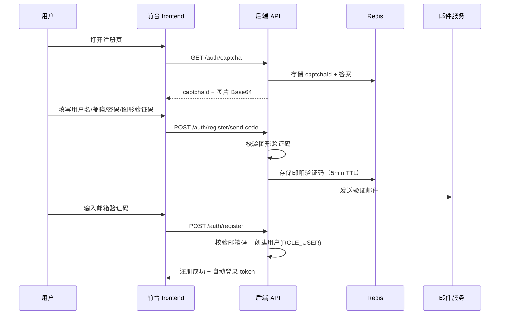
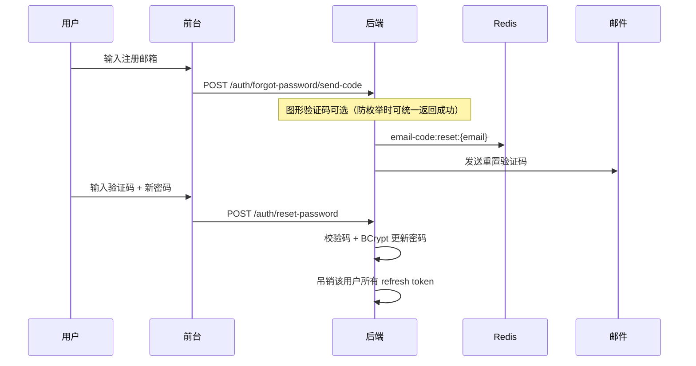

# 前台用户认证与权限设计

> 版本：1.0 | 状态：**已实现**  
> 关联：[PRODUCTION_READINESS.md](./PRODUCTION_READINESS.md)

本文档定义访客浏览、注册用户互动、管理员 CMS 三层权限模型，以及注册验证码、邮箱找回密码的完整方案。

---

## 1. 角色与权限矩阵

| 能力 | 访客 | 注册用户 (`ROLE_USER`) | 管理员 (`ROLE_ADMIN`) |
|---|---|---|---|
| 浏览文章/片段/项目/搜索 | ✅ | ✅ | ✅ |
| RSS / 归档 / 公开设置 | ✅ | ✅ | ✅ |
| 点赞（文章/评论/碎碎念/片段） | ❌ | ✅ | ✅ |
| 发表评论 / 回复 | ❌ | ✅ | ✅ |
| 留言板发帖 | ❌ | ✅ | ✅ |
| 友链申请 | ❌ | ✅ | ✅ |
| 邮件订阅 | ✅（无需账户） | ✅ | ✅ |
| 发布/管理文章 | ❌ | ❌ | ✅ |
| 后台 CMS | ❌ | ❌ | ✅ |

**原则：**

- 所有 **读操作** 对访客开放（与现有一致）。
- 所有 **写操作 / 互动操作** 需登录且具备 `ROLE_USER` 或更高权限。
- CMS `/api/v1/admin/**` 仍仅 `ROLE_ADMIN`。

---

## 2. 注册流程

### 2.1 流程概览



### 2.2 图形验证码

| 项 | 规格 |
|---|---|
| 类型 | 4–6 位字母数字，干扰线，PNG Base64 |
| 存储 | Redis key `captcha:{uuid}`，TTL 5 分钟 |
| 一次性 | 校验后立即删除 |
| 接口 | `GET /api/v1/auth/captcha` |

**响应示例：**

```json
{
  "code": 0,
  "data": {
    "captchaId": "550e8400-e29b-41d4-a716-446655440000",
    "imageBase64": "data:image/png;base64,..."
  }
}
```

### 2.3 邮箱验证码（注册）

| 项 | 规格 |
|---|---|
| 格式 | 6 位数字 |
| 存储 | Redis key `email-code:register:{email}`，TTL 5 分钟 |
| 发送间隔 | 同一邮箱 60 秒内不可重复发送 |
| 每日上限 | 同一邮箱 10 次 / 同一 IP 20 次 |
| 接口 | `POST /api/v1/auth/register/send-code` |

**请求体：**

```json
{
  "email": "user@example.com",
  "captchaId": "550e8400-...",
  "captchaCode": "a3b7"
}
```

### 2.4 完成注册

**`POST /api/v1/auth/register`**

```json
{
  "username": "devuser",
  "email": "user@example.com",
  "password": "SecurePass123!",
  "emailCode": "123456"
}
```

**校验规则：**

- 用户名：3–32 字符，`[a-zA-Z0-9_]`，唯一
- 邮箱：RFC 格式，唯一，注册时即标记 `email_verified=true`
- 密码：≥8 位，含字母与数字（可配置）
- 邮箱验证码：与 Redis 中一致且在 TTL 内

**成功后：**

- 创建用户，分配 `ROLE_USER`
- 返回 JWT access + refresh（与现有 login 响应结构一致）
- 设置 HttpOnly Cookie（`jiangou_access` / `jiangou_refresh`）

---

## 3. 忘记密码

### 3.1 流程



### 3.2 接口

| 方法 | 路径 | 说明 |
|---|---|---|
| POST | `/auth/forgot-password/send-code` | 发送重置验证码（需图形验证码） |
| POST | `/auth/reset-password` | 验证码 + 新密码完成重置 |

**重置请求体：**

```json
{
  "email": "user@example.com",
  "emailCode": "654321",
  "newPassword": "NewSecurePass456!"
}
```

**安全要求：**

- 邮箱不存在时仍返回「若邮箱存在则已发送」（防用户枚举），但不做实际发送
- 重置成功后吊销该用户全部 refresh token（强制重新登录）
- 验证码 TTL 5 分钟，一次性

---

## 4. 前台登录

### 4.1 复用现有 JWT 体系

现有 `AuthService.login()`、`JwtTokenProvider`、Cookie 机制可直接复用，扩展点：

| 变更 | 说明 |
|---|---|
| 登录角色 | 允许 `ROLE_USER` 登录（当前仅 ADMIN） |
| 登录入口 | 新增 frontend 页面 `/login`、`/register`、`/forgot-password` |
| 会话恢复 | frontend composable 调用 `GET /auth/me`（Cookie 自动携带） |
| 登出 | `POST /auth/logout`（与 admin 一致） |

### 4.2 前台路由守卫

```typescript
// frontend composables/useAuth.ts（规划）
// - restoreSession(): GET /auth/me
// - requireAuth(): 未登录跳转 /login?redirect=...
```

互动组件（点赞按钮、评论表单）在操作前检查 `isAuthenticated`；未登录显示「登录后操作」并跳转。

---

## 5. 权限隔离实现

### 5.1 SecurityConfig 变更（规划）

将以下路径从 `permitAll` 改为 `authenticated()`：

| 方法 | 路径 |
|---|---|
| POST | `/api/v1/articles/*/like` |
| POST | `/api/v1/comments` |
| POST | `/api/v1/comments/*/like` |
| POST | `/api/v1/notes/*/like` |
| POST | `/api/v1/snippets/*/like` |
| POST | `/api/v1/friend-links/apply` |

新增公开路径：

| 方法 | 路径 |
|---|---|
| GET | `/api/v1/auth/captcha` |
| POST | `/api/v1/auth/register/send-code` |
| POST | `/api/v1/auth/register` |
| POST | `/api/v1/auth/forgot-password/send-code` |
| POST | `/api/v1/auth/reset-password` |
| POST | `/api/v1/auth/login`（已有，扩展 USER 角色） |

### 5.2 角色扩展

Flyway `V7__user_auth.sql`（规划）：

```sql
-- 新增 USER 角色
INSERT INTO roles (code, name) VALUES ('USER', '注册用户');

-- users 表扩展
ALTER TABLE users ADD COLUMN email_verified TINYINT(1) NOT NULL DEFAULT 0;

-- 验证码记录表（可选，Redis 为主、DB 为审计）
CREATE TABLE verification_codes (
  id BIGINT PRIMARY KEY AUTO_INCREMENT,
  email VARCHAR(255) NOT NULL,
  code_hash VARCHAR(64) NOT NULL,
  purpose ENUM('register','reset_password') NOT NULL,
  expires_at DATETIME NOT NULL,
  used_at DATETIME NULL,
  created_at DATETIME NOT NULL DEFAULT CURRENT_TIMESTAMP,
  INDEX idx_email_purpose (email, purpose)
);
```

### 5.3 业务层变更

| 模块 | 变更 |
|---|---|
| `CommentService.create()` | 从 `SecurityContext` 取 `userId`；弃用手动 nickname（改用 `displayName`） |
| `LikeCounterService` | 去重键从 `fingerprint` 改为 `user:{userId}`（可保留 fingerprint 作迁移过渡） |
| `AuthService.login()` | 移除「必须 ADMIN」限制，改为「USER 或 ADMIN 均可」 |
| `RateLimitFilter` | 新增注册/发码限流规则 |

---

## 6. 邮件与生产配置

用户认证启用后，生产环境 **必须** 配置 SMTP：

```env
MAIL_HOST=smtp.example.com
MAIL_PORT=587
MAIL_USER=noreply@example.com
MAIL_PASSWORD=***
MAIL_SMTP_AUTH=true
MAIL_SMTP_STARTTLS=true
```

邮件模板（规划路径 `backend/monolith/src/main/resources/templates/email/`）：

| 模板 | 用途 |
|---|---|
| `register-code.html` | 注册验证码 |
| `reset-password-code.html` | 找回密码验证码 |

开发环境继续使用 Mailhog（`docker compose up -d` 自带，Web UI `:8025`）。

**ProdEnvValidator 扩展（Phase 2）：**

```java
// 当 jiangou.auth.registration-enabled=true 时
if (!StringUtils.hasText(mailHost)) {
    throw new IllegalStateException("启用用户注册时 MAIL_HOST 必填");
}
```

---

## 7. 前端页面规划

| 路由 | 页面 | 说明 |
|---|---|---|
| `/login` | 登录 | 用户名/邮箱 + 密码 |
| `/register` | 注册 | 图形验证码 → 发邮箱码 → 提交 |
| `/forgot-password` | 忘记密码 | 邮箱 → 验证码 → 新密码 |
| 全局 | Auth 状态 | Header 显示登录/用户菜单 |

**互动 UI 变更：**

- 文章详情页点赞按钮：未登录 → 弹窗或跳转 `/login?redirect=...`
- `CommentSection.vue`：未登录隐藏表单，显示「登录后评论」
- 移除或降级 `localStorage` fingerprint 逻辑（登录后不再需要）

---

## 8. 错误码扩展

| code | 说明 |
|---|---|
| 40101 | 未登录 |
| 40102 | 验证码错误或已过期 |
| 40103 | 图形验证码错误 |
| 40104 | 邮箱验证码发送过于频繁 |
| 40901 | 用户名或邮箱已存在 |
| 42202 | 密码强度不足 |

---

## 9. 测试计划

| 类型 | 用例 |
|---|---|
| 单元 | CaptchaService、EmailCodeService、RegisterService、ResetPasswordService |
| 集成 | 注册全流程、重置密码、未登录 401、USER 点赞/评论 |
| E2E | frontend 注册 → 登录 → 评论；未登录点赞被拦截 |
| 安全 | 验证码暴力破解限流、用户枚举防护 |

---

## 10. 与现有 admin 认证的关系

| 场景 | 行为 |
|---|---|
| admin 登录 | 不变，仍要求 `ROLE_ADMIN` |
| 前台用户尝试访问 `/admin/` | 403，路由守卫拒绝 |
| 同一 JWT 体系 | USER 与 ADMIN 共用 token 格式，通过 roles 区分 |
| GitHub OAuth | 暂仅 admin；后续可扩展为前台 OAuth 登录（非 P0） |
